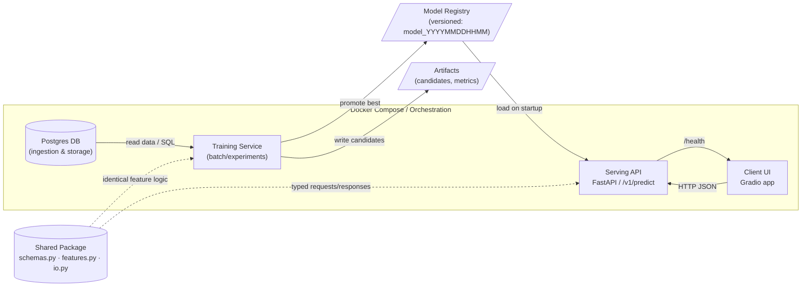

```mermaid
flowchart LR
  %% Big-picture ML system (4 services) with shared contracts and artifact flow

  subgraph ORCH["Docker Compose / Orchestration"]
    direction LR

    DB[("Postgres DB\n(ingestion & storage)")]
    TRAIN["Training Service\n(batch/experiments)"]
    SERVE["Serving API\nFastAPI / /v1/predict"]
    UI["Client UI\nGradio app"]
  end

  ARTS[/"Artifacts\n(candidates, metrics)"/]
  REG[/"Model Registry\n(versioned: model_YYYYMMDDHHMM)"/]
  SHARED[("Shared Package\nschemas.py · features.py · io.py")]

  %% Data & model lifecycle
  DB -->|read data / SQL| TRAIN
  TRAIN -->|write candidates| ARTS
  TRAIN -->|promote best| REG
  REG -->|load on startup| SERVE
  UI -->|HTTP JSON| SERVE

  %% Contracts / code reuse (no runtime dependency)
  SHARED -.->|typed requests/responses| SERVE
  SHARED -.->|identical feature logic| TRAIN

  %% Health & ops (minimal, still big-picture)
  SERVE -->|/health| UI

  %% Notes
  classDef dashed stroke-dasharray: 4 4
  linkStyle 5 stroke-dasharray: 4 4
  linkStyle 6 stroke-dasharray: 4 4
```