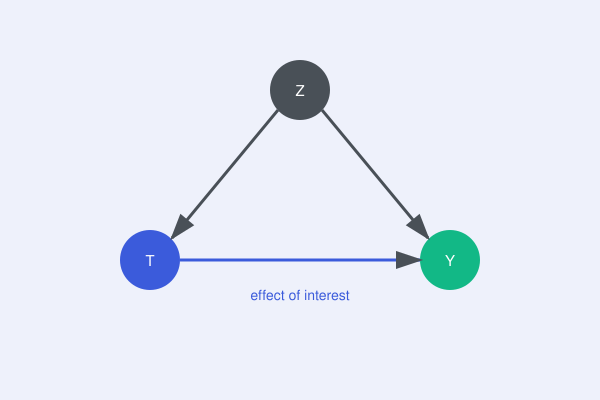

{fig-align="center" width=70%}

*Replace this with your real write-up. Suggested shape below.*

## The problem

The naive correlation everyone gets tempted by (e.g. "higher prices,
higher revenue") and why it's confounded.

## The core idea

The DAG above: identify the confounder, pick the identification strategy
(instrument, matching, diff-in-diff, whatever you actually used).

## Why it matters in practice

What decision this changed, and what it would have cost to get wrong.

## Further reading

- [Replace: link to the full PDF / paper / notes](#)
