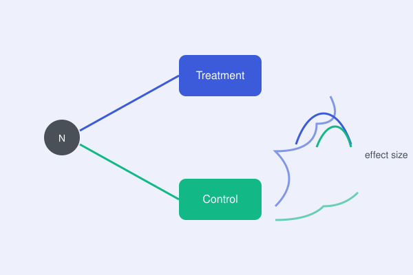

{fig-align="center" width=70%}

*Replace this with your real write-up. Suggested shape below.*

## The problem

What was broken about the naive A/B setup (peeking, multiple comparisons,
novelty effects, etc.)?

## The core idea

The one diagram/concept that fixes it — sequential testing boundary,
CUPED variance reduction, guardrail metric design.

## Why it matters in practice

The concrete before/after: decisions that changed, false positives avoided.

## Further reading

- [Replace: link to the full PDF / paper / notes](#)
