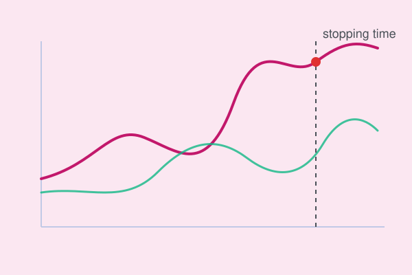

{fig-align="center" width=70%}

*Replace this with your real write-up. Suggested shape below.*

## The problem

One or two paragraphs: what decision are you modeling as a stopping
problem (e.g. when to exercise an option, when to stop an experiment,
when to intervene on a degrading system)?

## The core idea

Introduce the key mathematical object (Snell envelope, value function,
free boundary) with **one clear diagram** — the illustration above is a
placeholder for that.

## Why it matters in practice

Connect back to a real decision you or a team actually had to make.

## Further reading

- [Replace: link to the full PDF / paper / notes](#)
